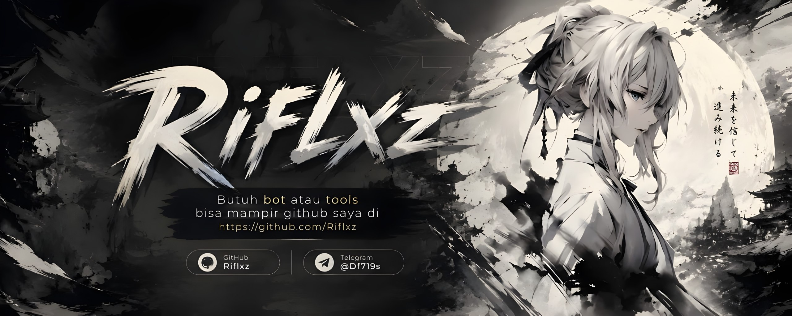
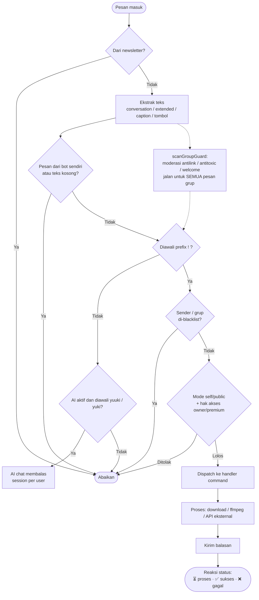
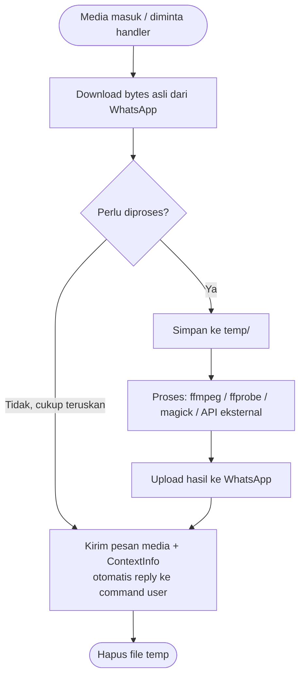
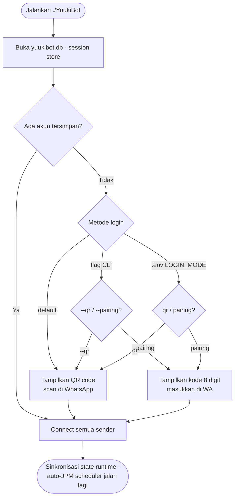

# YuukiBot

<!--
  YuukiBot — Bot WhatsApp multi-fitur berbasis Go (whatsmeow).
  Keyword: bot whatsapp, whatsapp bot, bot wa, whatsapp automation,
  golang, go, whatsmeow, bot grup, bot ai, broadcast jpm, open source.
-->

<p align="center">
  
</p>

<p align="center">
  
  
  
  
</p>

**YuukiBot** adalah **bot WhatsApp multi-fitur** berbasis **Go** ([whatsmeow](https://github.com/tulir/whatsmeow)) yang **open source**. Bot WA ini mendukung pencarian media, konversi file, edit gambar/video, sticker AI, AI chat, broadcast JPM, tools, hingga panggilan audio/video dengan multi-sender. Dijalankan sebagai binary tunggal — semua aset (termasuk QRIS donasi) sudah ter-embed di dalamnya.

> **Open source.** Source code tersedia di GitHub. Kalau kamu memakai / mengembangkan bot ini, mohon hormati pembuat: jangan hapus kredit developer, jangan klaim sebagai buatanmu, dan kalau mau mengembangkan silakan **fork** repository asli. Jangan lupa ⭐ **star** sebagai bentuk dukungan. 🙏

## 🚀 Quick Start

Cara paling cepat untuk menjalankan YuukiBot:

```bash
# 1. Clone & masuk folder
git clone https://github.com/Riflxz/YuukiBot.git
cd YuukiBot

# 2. Build binary (pakai vendor, tanpa internet)
go build -mod=vendor -o YuukiBot .

# 3. Salin & sesuaikan konfigurasi (ganti nomor owner kamu)
cp .env.example .env
nano .env

# 4. Jalankan, lalu scan QR di WhatsApp
./YuukiBot
```

> Butuh langkah detail? Lihat [Instalasi dari Source](#instalasi-dari-source-open-source) dan [Konfigurasi (.env)](#konfigurasi-env).

## Daftar Isi

- [🚀 Quick Start](#quick-start)
- [✨ Fitur Utama](#fitur-utama)
- [⚙️ Requirements](#requirements)
- [🚀 Instalasi dari Source](#instalasi-dari-source-open-source)
- [🔧 Konfigurasi (.env)](#konfigurasi-env)
- [▶️ Menjalankan](#menjalankan)
- [📁 Struktur File](#struktur-file)
- [🔄 Alur Kerja](#alur-kerja)
- [❓ FAQ / Troubleshooting](#faq--troubleshooting)
- [🤝 Kontributor](#kontributor)
- [👨‍💻 Developer](#developer)
- [💖 Donasi](#donasi)
- [📄 Lisensi](#lisensi)

## Fitur Utama

YuukiBot punya banyak fitur yang dikelompokkan per kategori. Berikut ringkasannya:

### 💬 Umum & AI

| Command | Fungsi |
|---|---|
| `!menu`, `!ping`, `!info`, `!sticker`, `!donasi`, `!contributor` | Navigasi menu (4 versi tampilan), cek status, buat sticker, QRIS donasi, daftar kontributor |
| `!afk` | Tandai sedang AFK — siapa pun yang mention kamu akan diberi tahu |
| `!ai`, `yuuki <pertanyaan>` | AI chat Yuuki: `!ai on/off` (owner), semua user ngobrol via `yuuki`/`yuki`, session per user (`!ai list`/`load`/`new`) |

### 🔍 Search & Tools

| Command | Fungsi |
|---|---|
| `!yts`, `!wiki`, `!kbbi`, `!lyrics`, `!pinterest`, `!bingimage` | Cari video, artikel, definisi, lirik, gambar |
| `!tr`, `!qr`, `!ss`, `!barcode`, `!tempmail`, `!whatmusic`, `!ipinfo` | Translate, QR/barcode, screenshot web, identifikasi lagu, lookup IP |

### 🖼️ Image, Konversi & Sticker

| Command | Fungsi |
|---|---|
| `!hd`, `!hdvid`, `!removebg`, `!blur`, `!cap`, `!wanted` | Perjelas gambar/video, hapus background, efek gambar |
| `!tomp3`, `!toimg`, `!togif`, `!tourl`, `!tofile`, `!resend`, `!rvo` | Konversi media, upload ke URL, kirim ulang tanpa kompres |
| `!tenor`, `!sai`, `!brat` | Cari sticker, jadikan sticker AI, buat sticker brat |

### 👥 Grup

| Command | Fungsi |
|---|---|
| `!jaga`, `!antilink`, `!antitoxic`, `!welcome`, `!setwelcome`, `!warn`, `!warnlist`, `!resetwarn` | Moderasi: peringatkan link/kata kasar, sambut member baru (pesan custom), warn 3x = kick otomatis — config persist antar restart |
| `!close`/`!open`, `!add`, `!kick`, `!promote`/`!demote`, `!tagall`, `!hidetag`, `!setname`, `!setdesc`, `!setppgc`, `!linkgc`, `!revoke`, `!infogc`, `!out` | Manajemen: kunci/buka chat, tambah/kick member (multi), naik/turun admin, tag semua, ubah nama/deskripsi/foto, link undangan, info grup, bot keluar |

### 📢 Broadcast & Saluran

| Command | Fungsi |
|---|---|
| `!jpm`, `!jpmht`, `!jpmch`, `!autojpm`, `!stopjpm`, `!bljpm` | Broadcast ke semua grup/saluran (owner): mode basic/hidetag/channel/update/auto, jeda antar grup, blacklist per fitur, auto-broadcast terjadwal |
| `!getidch`, `!upch`, `!kirim` | Ambil ID saluran dari link (semua user), posting & kirim konten saluran |

### 🎮 Fun & Stalker

| Command | Fungsi |
|---|---|
| `!scanrepo`, `!githubstalk`, `!npmstalk`, `!tiktokstalk`, `!robloxstalk`, `!jodoh`, `!howgay` | Scan repo GitHub untuk security risk, stalk akun, cek kecocokan, dll |

### 🎵 Audio/Call & Premium

| Command | Fungsi |
|---|---|
| `!play`, `!skip`, `!stopcall`, `!antrian`, `!prank` | Streaming lagu/video ke panggilan (owner/premium) |
| `!am-send`, `!am-aktif`, `!amkey` | Aktivasi akun Alight Motion via magic link; key kedaluwarsa -> diarahkan beli (10k/bln), ganti key sendiri via `!amkey <apikey>` tanpa restart |

### ⚙️ Sender & Owner

| Command | Fungsi |
|---|---|
| `!addsender`, `!ls` | Kelola akun penelpon tambahan (owner) |
| `!bl`, `!clear`, `!self`, `!public`, `!setmenu`, `!ap`, `!dp`, `!uploadgh` | Blacklist, mode bot, manajemen akses |

Daftar lengkap semua command: ketik `!allmenu` di WhatsApp.

### ⚡ Fitur Otomatis

Selain command manual, YuukiBot punya beberapa fitur yang jalan otomatis:

| Fitur | Deskripsi |
|---|---|
| **Auto-JPM lanjut sendiri** | Broadcast JPM yang sedang berjalan otomatis lanjut lagi setelah bot restart |
| **Sambutan menu personal** | `!menu` menyapa pengirim (@mention di grup, tanpa tag di PM) lengkap dengan role (Owner/Premium/User) |
| **Moderasi grup** | Antilink / antitoxic / welcome jalan otomatis untuk semua pesan grup (lihat [Fitur Grup](#grup)) |

## Requirements

| Kebutuhan | Versi | Fungsi |
|---|---|---|
| Binary `YuukiBot` | - | Bot itu sendiri (tidak butuh runtime Go) — atau build dari source |
| ffmpeg + ffprobe | terbaru | Proses video/audio: `!hdvid`, `!tomp3`, kompres, dll |
| ImageMagick (`magick`) | terbaru | Proses gambar: `!hd`, `!blur`, efek |
| yt-dlp | opsional | Download YouTube (`!play`, `!tt`). Tanpa ini bot pakai API fallback |
| Go | 1.25+ | Hanya untuk build dari source |

### Instalasi Dependensi (Ubuntu/Debian)

```bash
sudo apt update
sudo apt install -y ffmpeg imagemagick

# yt-dlp (opsional — untuk download YouTube yang lebih stabil)
sudo curl -L https://github.com/yt-dlp/yt-dlp/releases/latest/download/yt-dlp \
  -o /usr/local/bin/yt-dlp
sudo chmod +x /usr/local/bin/yt-dlp
```

### Instalasi Go (hanya untuk build)

```bash
sudo apt install -y golang-go
# atau unduh dari https://go.dev/dl — butuh Go 1.25+
```

## Instalasi dari Source (Open Source)

Karena YuukiBot sekarang **open source**, kamu bisa build binary sendiri dari source. Repo sudah termasuk `vendor/`, jadi tidak perlu internet saat build.

```bash
# 1. Clone repository
git clone https://github.com/Riflxz/YuukiBot.git
cd YuukiBot

# 2. Build binary (pakai vendor, tanpa download dependency)
go build -mod=vendor -o YuukiBot .

# 3. (Opsional) salin contoh konfigurasi & sesuaikan nomor kamu
cp .env.example .env
nano .env

# 4. Jalankan
./YuukiBot
```

> **Catatan:** Sebelum dipakai, jangan lupa ganti `OwnerNumber` / `CreatorNumber` / `BotNumber` di `config.go` (atau lewat `.env`) dengan nomor kamu sendiri — nilai default di source sudah di-set ke placeholder `628xxx`.

## Konfigurasi (.env)

Semua setting bisa diatur lewat file `.env` **tanpa build ulang**. Salin contoh lalu sesuaikan:

```bash
cp .env.example .env
nano .env
```

| Variabel | Default | Fungsi |
|---|---|---|
| `OWNER_NUMBER` | bawaan config | Nomor yang bot anggap owner |
| `CREATOR_NUMBER` | ikut owner | Nomor creator (`shell`, `addowner`) |
| `BOT_NUMBER` | bawaan config | Nomor bot (info & default pairing) |
| `LOGIN_MODE` | `qr` | Metode sambung pertama: `qr` atau `pairing` |
| `PAIRING_NUMBER` | `BOT_NUMBER` | Nomor tujuan pairing saat `LOGIN_MODE=pairing` |
| `MTZ_API_KEY` | bawaan config | API key Alight Motion (bisa diganti kapan saja via `!amkey`) |
| `RCH_JWT` | bawaan config | JWT reaksi channel (`!rch` / `!reactch`) — punya masa berlaku, ganti kalau kedaluwarsa |
| `THERESAV_APIKEY` | bawaan config | API key Theresav (download YouTube: `!ytmp3`, `!ytplay`, dll) — daftar gratis di [api.theresav.biz.id](https://api.theresav.biz.id) |

Catatan:

- Tanpa `.env` pun bot tetap jalan dengan default bawaan.
- Environment asli (shell/systemd/docker) selalu menang atas `.env`.
- Flag CLI (`--qr` / `--pairing 628xxx`) selalu menang atas `LOGIN_MODE`.

## Menjalankan

```bash
./YuukiBot
```

Pertama kali dijalankan, metode login mengikuti `LOGIN_MODE` di `.env` (default: QR code di terminal — scan dengan WhatsApp > Perangkat Tertaut). Session tersimpan di `yuukibot.db`, jadi scan/pairing hanya sekali.

Sender tambahan (akun penelpon):

```bash
./YuukiBot --qr                 # login sender baru via QR
./YuukiBot --pairing 628xxx     # login sender baru via kode pairing 8 digit
```

## Struktur File

```text
YuukiBot            binary utama (semua aset ter-embed)
.env                konfigurasi deployment (opsional — lihat .env.example)
yuukibot.db         session WhatsApp (sqlite) — jangan dihapus
database/           data runtime JSON:
                    owner.json, premium.json, blacklist.json,
                    group_state.json   (config jaga grup + warn),
                    ai_state.json      (status & session AI chat),
                    jpm.json           (setting JPM + auto-broadcast),
                    am_key.json        (API key Alight Motion hasil !amkey)
temp/               cache file sementara (dibersihkan otomatis / !clear)
uploads/            hasil upload !uploadgh
```

## Alur Kerja

### Alur pesan masuk



### Alur media (foto/video/audio)



### Alur login



## ❓ FAQ / Troubleshooting

### Bot tidak merespon command?

1. Pastikan bot sudah connect (lihat log terminal / `!ping`).
2. Pastikan kamu mengetik command dengan prefix yang benar (`!`), contoh `!menu`.
3. Cek apakah nomor/grup kamu di-blacklist (`!bl`).
4. Pastikan mode bot `public` (bukan `self`) — owner bisa cek dengan `!public`.

### Bagaimana cara ganti nomor owner?

Edit `.env` lalu isi `OWNER_NUMBER` dengan nomor baru (format `628xxx`, tanpa `+`/spasi/strip), lalu restart bot. Atau ubah `OwnerNumber` di `config.go` lalu build ulang.

### Bagaimana cara login ulang / ganti akun WhatsApp?

Hapus file `yuukibot.db`, lalu jalankan `./YuukiBot` lagi — bot akan minta scan QR / pairing baru.

### Kenapa bot tidak bisa download YouTube?

Pastikan `yt-dlp` terinstall (lihat [Requirements](#requirements)). Kalau tetap gagal, cek `THERESAV_APIKEY` di `.env` — bot pakai API fallback kalau yt-dlp tidak ada.

### Bagaimana cara menambah sender (akun penelpon)?

Jalankan `./YuukiBot --qr` atau `./YuukiBot --pairing 628xxx` untuk login akun tambahan, lalu kelola dengan `!addsender` / `!ls` (owner).

### Apakah session WhatsApp aman?

Ya — session tersimpan di `yuukibot.db` yang **tidak ikut di-commit** ke repo (ada di `.gitignore`). Jangan pernah membagikan file ini ke orang lain.

### Command owner / premium tidak jalan?

Pastikan nomor kamu terdaftar sebagai owner (`.env` `OWNER_NUMBER`) atau premium (`database/premium.json`). Beberapa fitur (call, JPM) memang khusus owner/premium.

## Kontributor

Terima kasih kepada semua yang telah berkontribusi pada pengembangan YuukiBot:

| Kontributor | Kontak |
|---|---|
| kyu ganteng imut | [t.me/kyugaperawan](https://t.me/kyugaperawan) · [t.me/kyunotdev](https://t.me/kyunotdev) · [t.me/raramasihkyu](https://t.me/raramasihkyu) |
| Rijalganzz | [github.com/RIJALGANZZZ](https://github.com/RIJALGANZZZ) |
| Yamzzdep | [github.com/Yamzzdev](https://github.com/Yamzzdev) |
| Ryuhan | [github.com/ryuhandev](https://github.com/ryuhandev) |

In-game juga bisa lihat lewat tombol **🏆 TQTO** di menu (`!menu`) atau ketik `!contributor` / `!tqto`.

## Developer

<p align="center">
  
</p>

| | |
|---|---|
| Developer | **RIflxz** |
| GitHub | [github.com/Riflxz](https://github.com/Riflxz) |
| Linktree | [lynk.id/riflx](https://lynk.id/riflx) |
| Saluran WhatsApp | [MTCommunity](https://whatsapp.com/channel/0029Vb7tUzP9xVJiGkFNVc3q) |

Ikuti saluran WhatsApp untuk update fitur terbaru, info bot, dan pengumuman lainnya.

## 💖 Donasi

YuukiBot dikembangkan secara gratis dan open source. Kalau bot ini bermanfaat buat kamu, kamu bisa mendukung pengembangan lewat donasi:

- **QRIS** — scan QRIS yang muncul di `!donasi` di WhatsApp.
- **Star repo** — ⭐ star repository ini sebagai bentuk dukungan moral.
- **Kontribusi** — bantu perbaiki bug / tambah fitur lewat pull request.

Setiap dukungan sangat berarti untuk menjaga bot ini tetap gratis dan terus berkembang. Terima kasih! 🙏

## Lisensi

Open source. Hak cipta milik developer asli. Kamu bebas memakai, memodifikasi, dan mengembangkan bot ini, dengan syarat:

- **Jangan hapus kredit developer** / nama pembuat di source.
- **Jangan klaim bot ini sebagai buatanmu sendiri.**
- Kalau mau mengembangkan, **fork** repository asli (jangan salin mentah-mentah).
- **Star** repository asli sebagai bentuk dukungan & apresiasi. 🙏
